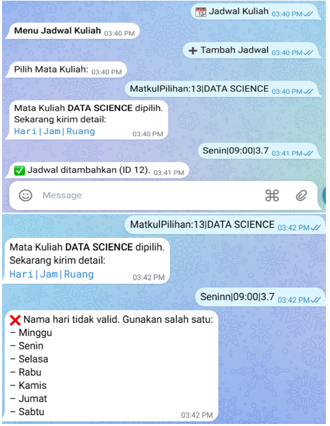

## 📘 Telegram Study Planner Bot

Panduan lengkap konfigurasi bot Telegram berbasis Google Apps Script untuk mencatat Mata Kuliah, Jadwal, Tugas, dan Pengingat otomatis.

---

### 1. Prasyarat

* Akun Google (untuk Google Sheets & Apps Script)
* Bot Telegram (dari @BotFather)
* Editor kode (VS Code / Apps Script Editor)

---

### 2. Buat dan Konfigurasi Google Spreadsheet

1. **Buka** Google Sheets dan buat spreadsheet baru dengan nama `StudyPlanner`.
2. **Buat** 3 sheet berturut-turut dengan nama:

   * `MataKuliah`
   * `JadwalKuliah`
   * `Tugas`
3. **Susun header** masing-masing sheet:

   * **MataKuliah**: `userId | id | namaMatkul`
   * **JadwalKuliah**: `userId | id | matkulId | hari | jam | ruang`
   * **Tugas**: `userId | id | matkulId | namaTugas | deadline | keterangan`
4. **Catat** Spreadsheet ID (dari URL):
   `https://docs.google.com/spreadsheets/d/SPREADSHEET_ID/edit`

   > Contoh: `1AbCdEfGhIjKlMnOpQrStUvWxYz1234567890`

---

### 3. Daftar Bot Telegram & Dapatkan Token

1. Di Telegram, **chat** dengan [@BotFather](https://t.me/BotFather).
2. Kirim perintah `/newbot` lalu ikuti instruksi:

   * **Name**: `StudyPlannerBot` (contoh)
   * **Username**: `StudyPlanner_Bot` (harus unik)
3. BotFather akan mengembalikan **Token API**:

   ```js
   const TELEGRAM_TOKEN = '123456789:ABC-DEF1234ghIkl-zyx57W2v1u123ew11';
   ```
4. Simpan token tersebut.

---

### 4. Buat Google Apps Script

1. **Buka** kembali Google Spreadsheet `StudyPlanner`.
2. Pilih **Extensions → Apps Script**.
3. **Hapus** kode di `Code.gs` lalu **paste** seluruh script Telegram Planner.
4. **Ganti** placeholder di bagian atas:

   ```js
   const TELEGRAM_TOKEN = 'ISI_TOKEN_TELEGRAM';
   const TELEGRAM_URL   = 'https://api.telegram.org/bot' + TELEGRAM_TOKEN;
   const SPREADSHEET_ID = 'ISI_SPREADSHEET_ID';
   ```
5. **Simpan** proyek (ikon 💾) dan beri nama misalnya `StudyPlannerScript`.

---

### 5. Atur Izin & Layanan

1. Di menu kiri, pilih **Services (+)**.
2. Tambahkan layanan:

   * **Google Sheets API**
   * **Properties Service**
   * **UrlFetchApp** (bawaan)
3. Klik **Deploy → Test deployments**. Beri izin akses ke akun Google, izinkan semua permintaan.

---

### 6. Deploy sebagai Web App

1. Pilih **Deploy → New deployment**.
2. **Tipe**: `Web app`.
3. **Deskripsi**: `Telegram webhook`.
4. **Execute as**: Me (your account).
5. **Who has access**: Anyone.
6. Klik **Deploy**, lalu **Authorize** jika diminta.
7. **Salin** URL Web App, misal:

   ```text
   https://script.google.com/macros/s/AKfycbx.../exec
   ```

---

### 7. Pasang Webhook di Bot Telegram

Jalankan perintah berikut (bisa di browser atau terminal):

```bash
curl -X GET "https://api.telegram.org/bot<TELEGRAM_TOKEN>/setWebhook?url=<WEB_APP_URL>"
```

* Ganti `<TELEGRAM_TOKEN>`
* Ganti `<WEB_APP_URL>` dengan URL Web App Anda.
* Pastikan responnya:

  ```json
  {"ok":true,"result":true,"description":"Webhook is set"}
  ```

---

### 8. Testing & Penggunaan

1. Buka chat dengan bot Anda.
2. Kirim `/start` → harus muncul menu utama.
3. Coba tambah Mata Kuliah:

   * Tekan **📚 Mata Kuliah** → **➕ Tambah Matakuliah**
   * Ketik: `Matkul: Algoritma` → bot akan konfirmasi.
4. Cek spreadsheet, data harus tersimpan.
5. Tambah Jadwal / Tugas / Pengingat → ikuti alur.

---

# Dokumentasi





